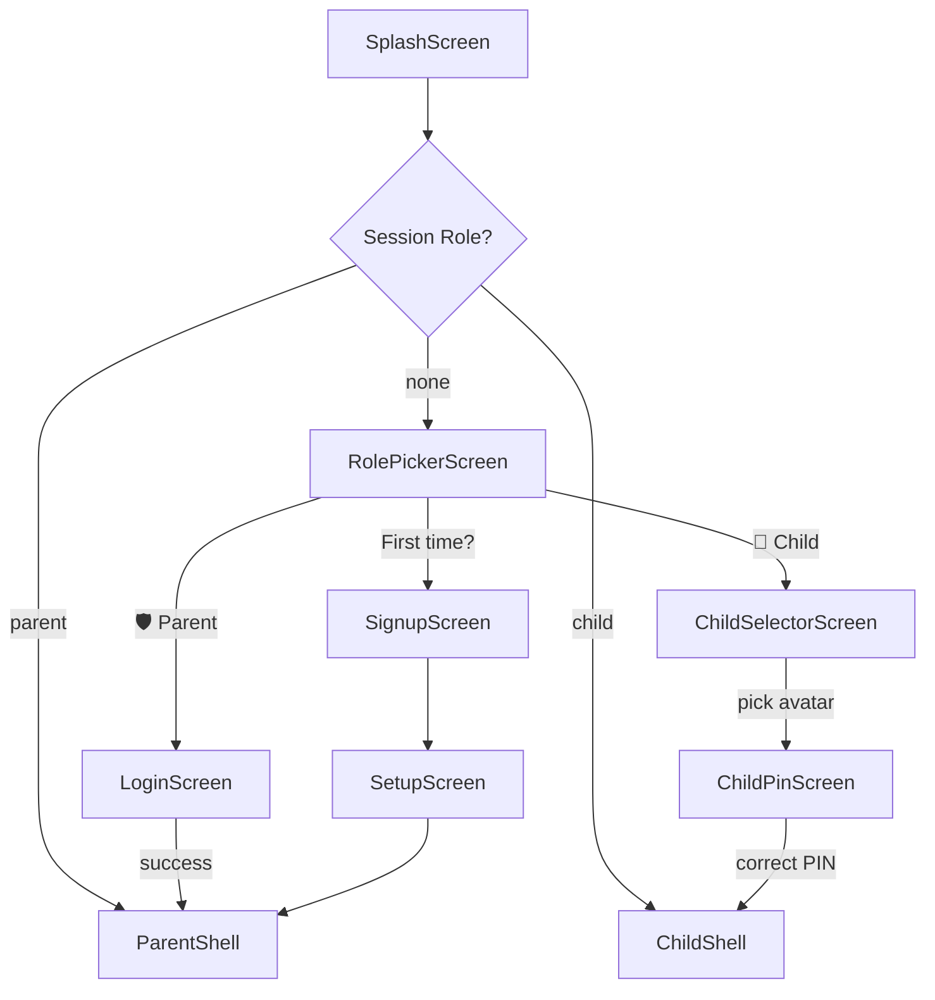

# SafeScreen Dual Login — Implementation Summary

## ✅ All Phases Implemented

### App Flow

## Files Created (6 new screens)

| File | Purpose |
|------|---------|
| [role_picker_screen.dart](file:///h:/parental%20control%20app%20it3/Parental_control_app/lib/screens/role_picker_screen.dart) | Animated Parent vs Child role selection with floating particles |
| [child_selector_screen.dart](file:///h:/parental%20control%20app%20it3/Parental_control_app/lib/screens/child_selector_screen.dart) | Game-style character select with bouncing avatars |
| [child_pin_screen.dart](file:///h:/parental%20control%20app%20it3/Parental_control_app/lib/screens/child_pin_screen.dart) | 4-digit PIN with shake animation & 30s lockout |
| [parent_shell.dart](file:///h:/parental%20control%20app%20it3/Parental_control_app/lib/screens/parent_shell.dart) | Parent-only tabs: Dashboard, Controls, Activity, Location, Settings |
| [child_shell.dart](file:///h:/parental%20control%20app%20it3/Parental_control_app/lib/screens/child_shell.dart) | Child-only tabs: My Time, Rewards, Virtual Pet, Profile |
| [child_dashboard_screen.dart](file:///h:/parental%20control%20app%20it3/Parental_control_app/lib/screens/child_dashboard_screen.dart) | Child-friendly dashboard with motivational messages |
| [child_profile_screen.dart](file:///h:/parental%20control%20app%20it3/Parental_control_app/lib/screens/child_profile_screen.dart) | Child's profile with achievements & switch-profile |
| [main_shell.dart](file:///h:/parental%20control%20app%20it3/Parental_control_app/lib/screens/main_shell.dart) | Backward-compat alias → ParentShell |

## Files Modified (5 existing files)

| File | Change |
|------|--------|
| [session_service.dart](file:///h:/parental%20control%20app%20it3/Parental_control_app/lib/services/session_service.dart) | Added role key ('parent' \| 'child') + role-aware save/query methods |
| [splash_screen.dart](file:///h:/parental%20control%20app%20it3/Parental_control_app/lib/screens/splash_screen.dart) | Routes based on saved role → ParentShell / ChildShell / RolePickerScreen |
| [login_screen.dart](file:///h:/parental%20control%20app%20it3/Parental_control_app/lib/screens/login_screen.dart) | Uses `saveParentSession()` + navigates to `ParentShell` |
| [signup_screen.dart](file:///h:/parental%20control%20app%20it3/Parental_control_app/lib/screens/signup_screen.dart) | Uses `saveParentSession()` |
| [settings_screen.dart](file:///h:/parental%20control%20app%20it3/Parental_control_app/lib/screens/settings_screen.dart) | Logout goes to `RolePickerScreen` |
| [setup_screen.dart](file:///h:/parental%20control%20app%20it3/Parental_control_app/lib/screens/setup_screen.dart) | Navigates to `ParentShell` after setup |

## Creative Features Included

| Feature | Where |
|---------|-------|
| 🎮 **Character Select** — avatars bounce on idle, game-style card layout | `child_selector_screen.dart` |
| ✨ **Floating Particles** — ambient particle animation on role picker | `role_picker_screen.dart` |
| 🔐 **PIN Lockout** — 3 wrong attempts = 30-second countdown lock | `child_pin_screen.dart` |
| 💫 **Shake Animation** — wrong PIN makes dots shake | `child_pin_screen.dart` |
| 🌟 **Motivational Messages** — change dynamically with usage % | `child_dashboard_screen.dart` |
| 🔥 **Daily Login Streak** — streak counter displayed on dashboard | `child_dashboard_screen.dart` |
| 🐾 **Virtual Pet** — bouncing pet, happiness bar, feed/play/choose pet | `child_shell.dart` |
| 🏆 **Achievements** — First Day, 3-Day Streak, 100 Points, Bookworm | `child_profile_screen.dart` |
| 🎨 **Per-card unique colors** — each child avatar card gets a different accent | `child_selector_screen.dart` |

## Tab Separation

### Parent Shell (5 tabs)
> Dashboard · Controls · Activity · Location · Settings

### Child Shell (4 tabs)
> My Time · Rewards · Virtual Pet · My Profile

**Zero tab bleed** — no child sees Controls/Settings, no parent sees Virtual Pet/Profile.

## Compilation Status
✅ **Zero errors, zero warnings** from new code. Only pre-existing `location_screen.dart` issue remains.
